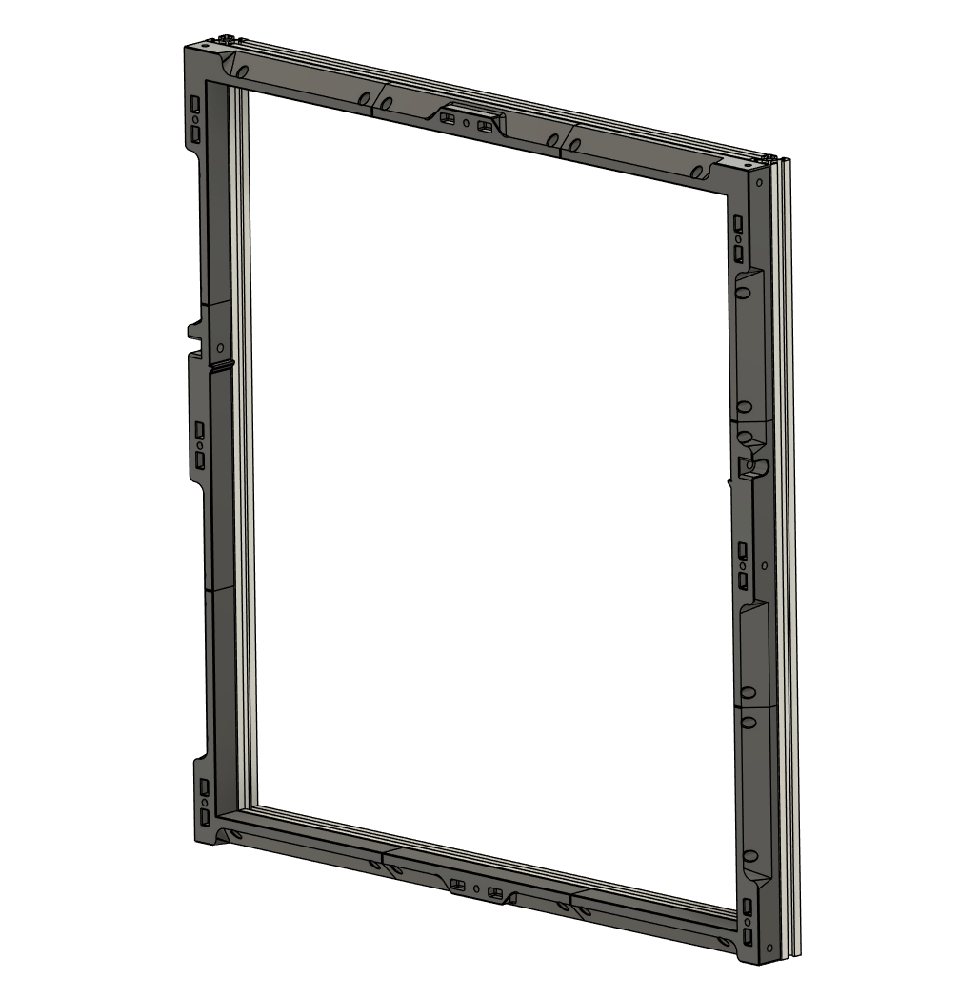

# STLs for LDO Kit
This directory contains STL files specific to the LDO kit.

## LDO Door Buffer

Based on the original StealthChanger [Door Buffer](https://github.com/DraftShift/DoorBuffer) design. This version allows for [LDO Doors](https://github.com/MotorDynamicsLab/LDOVoron2/tree/main/STLs/LDO%20Door) to be mounted. Choose the 300 or 350 based on your printer size, the short version is used for short docks only. 

## LDO Hinge

This is a hinge for the StealthChanger extrusion tophat. The hinge features a stopper that allows the tophat to rest at just over 90 degrees when opened.

## LDO SexBall Probe

This converts the normal LDO nozzle probe into a calibration probe for the toolchanger system. 